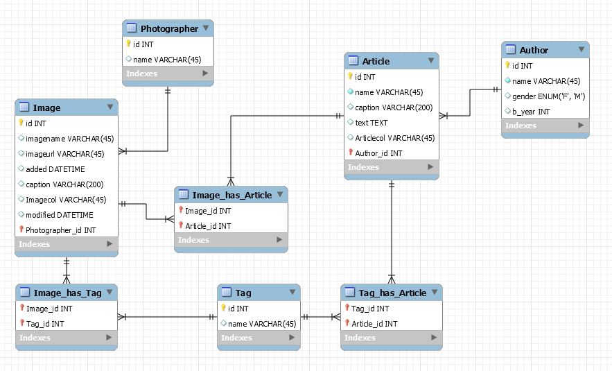

#DDL exercises
##Part 1: From database to model
1. Look at the model in the image below

2. Write the sql to create the tables in the database as shown in the model
3. Write sql to add the columns to create the relationships between tables
4. Alter the Image table to have default values for the 2 date types in the image table
5. Enforce referential integrity between the tables by writing the foreign key constraints on the proper columns.
6. Save the script (.sql file)
7. Create a model in mysql workbench from the database (reverse engineer).

##Part2: From model to database
1. Try creating the model in mysql workbench diagram editor
2. Forward engineer the model to create the database
3. Which way do you find most easy?
4. Enter dummy data into the database.

##Part3: Create views
1. Create a view with authors and their articles
2. Create another view with tags, their article texts and image url