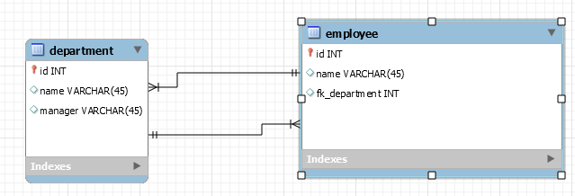

#DATABASE
##PLAN
###Learning objectives
- Convert domain model to database model
- Use visual database tool
- Query database
- Manipulate database
- Set up database
- Normalize database
- Connect to database with JDBC

####DAY 1 (MONDAY): MYSQL WORKBENCH / SCRIPTING
From business to database  
Conceptual model / Logical model / Physical model  

Concepts / Terms  

Scripting  
Model to script <-> Script to model  
Backup database / Test database  

SQL / Data query (DQL)  
&nbsp;&nbsp;&nbsp;&nbsp;SELECT / DISTINCT / WHERE / ORDER BY / FUNCTIONS / GROUP BY  
####DAY 2 (TUESDAY): SQL QUERIES
Temporary tables / ColumnNames / * / Aliases / AS / Concat<br>
=, <>, >, <, >=, <=, BETWEEN, LIKE (Wildcards), IN, NOT<br>

SQL / Data Manipulation (DML) <br>
&nbsp;&nbsp;&nbsp;&nbsp;INSERT / UPDATE / DELETE (Cascade)<br>
JOIN

####DAY 3 (WEDNESDAY): DATABASE DESIGN
We are going to design a database from scratch using DDL. We will look at how to enforce referential entegrity using foreign keys and junction tables. We will also look at other types of database constraints we can use.  

**Userfull commands:**  
`SELECT @@Global.sql_mode;`  
`SET GLOBAL sql_mode = '<modes seperated by commas>';` 
```CREATE DATABASE mydb  
  DEFAULT CHARACTER SET utf8  
  DEFAULT COLLATE utf8_general_ci;
```  
```ALTER TABLE <tablename>  
ADD FOREIGN KEY (<collumn name in this table>)  
REFERENCES <other table name>(<primary key collumn name in other table>)``` 
 

**Constraints** 
1. entity integrity (primary key constraint)
2. referential integrity (foreign key)
3. data
	1. enum and set
	2. invalid data
		1. date format
		2. not null  

**Topics**  
1. Create table
2. Drop table if exists (Order of drop table statements in reverse)
3. Alter table
4. Composite primary key
5. Foreign key constraints
6. Circular references
7. Creating a DDL script for the application
8. Creating a MySql View

**Circular reference example**  
```Employees  
    EmployeeID <PK>  
    DepartmentID <FK> NOT NULL  
Departments  
    DepartmentID <PK>  
    EmployeeID <FK> NOT NULL  
```



**Readings**  
[Foreign key constraints](https://www.w3schools.com/sql/sql_foreignkey.asp)
[SQL-constraints](https://www.tutorialspoint.com/sql/sql-constraints.htm)  
[Mysql strict mode](https://dev.mysql.com/doc/refman/5.7/en/sql-mode.html#sql-mode-strict)  

[Exercises](Exercises/DDLexercise.md)

####DAY 4 (THURSDAY): NORMALIZATION / OPTIMIZATION
#####Redundancy / Anomalies / Inconsistencies
#####Normalization
####DAY 5 (FRIDAY): STUDY POINT ASSIGNMENT

##LITTERATURE
###MYSQL WORKBENCH
[Workbench](https://dev.mysql.com/doc/workbench/en/)<br>
[Data modeling](https://dev.mysql.com/doc/workbench/en/wb-data-modeling.html)<br>
[Reverse engineering](https://dev.mysql.com/doc/workbench/en/wb-reverse-engineer-live.html)
###MYSQL TUTORIAL
[MySQL Tutorial](http://www.mysqltutorial.org/basic-mysql-tutorial.aspx)<br>
[MySQL Cascade](http://www.mysqltutorial.org/mysql-on-delete-cascade/)<br>
[MYSQL Data types](https://www.tutorialspoint.com/mysql/mysql-data-types.htm)
###SQL TUTORIAL
[SQL Tutorial](http://www.w3schools.com/sql/default.asp) 
###WIKIPEDIA SQL
[Wikipedia SQL](https://en.wikipedia.org/wiki/SQL)